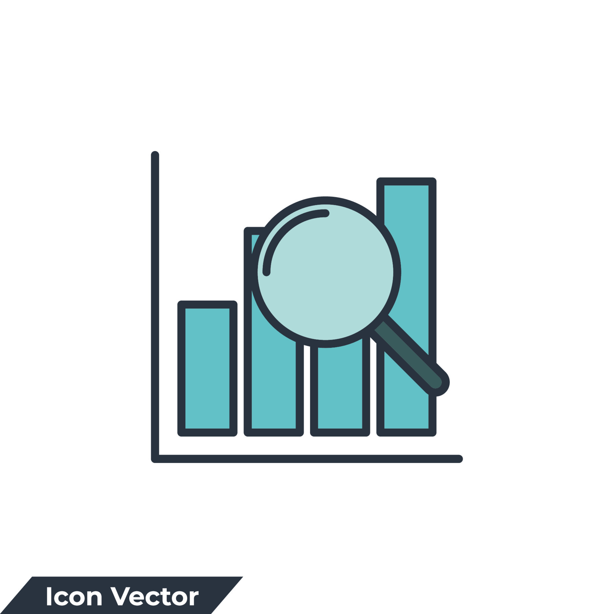
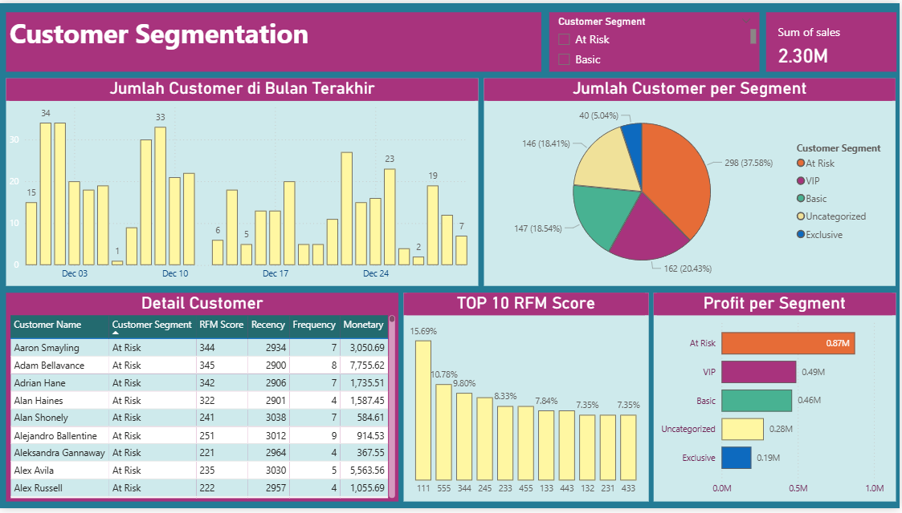

# Customer Segmentation Dashboard
This Project contents the Analysis of Telco-Churn Customer

## What is Customer Segmentation?

Customer segmentation is the process by which you divide your customers up based on common characteristics – such as demographics or behaviours, so your marketing team or sales team can reach out to those customers more effectively.

## Types of customer segmentation

- Segmenting customers based on who they are
The process of understanding who customers are typically focused on psychographics, demographics and, in the case of B2B, firmographics. This will include factors such as: Age, Geography, Urbanisation, Income, Relationship Status, Family, Job Type

-Segmenting customers based on what they do
You can also segment customers based on how much they spend (share of wallet), how often, and what products (this allows you to see how much you can increase spend). This is more focused on behaviours. Such as: Basket Size, Share of Wallet, Tenure (how long they stay with you), Long-term Loyalty (a combination of share of wallet and tenure)

## Description of Customer Segmentation

## Segmenting SuperStore Dataset

In this report, I will share the summarize of Customer Segmentation from Superstore Dataset :
RFM Methods : 
- Last Transaction Date: Identify the last transaction date for each customer.
- R Value (Recency): Measure the time elapsed from the last transaction until today.
- F Value (Frequency): Calculate the number of unique transactions for each customer.
- M Value (Monetary): Calculate the total transaction value for each customer.

## What is the distribution of the number of customers over time?

The distribution of SuperStore sales data shows a fluctuating pattern every day. The highest number of customers occurred on December 3rd, with a total of 34 customers.

## What is the total number of customers in each segmentation?

The number of customers in each customer segmentation within the SuperStore sales data shows that the 'At Risk' segment (Customers with low Recency or Frequency, but with moderate Monetary value. They may not have interacted recently or shop infrequently) dominates the created customer segmentation with a total of 298 customers, representing 37.58% of the total customer segmentation.

## Who are the customers included in each RFM segment?

From the two tables above, we can see that Sanjit Engle is a very loyal customer, even becoming a VIP in the created customer segmentation, while Michelle Lonsdale is included in the 'At Risk' customer segmentation.

## What is the total profit generated by each customer segmentation?

In the attached chart, we can see that the most profit is generated by the 'At Risk' customer segmentation, amounting to 0.87 M. Although this is the 'At Risk' segment, meaning they may not have interacted recently or shop infrequently, they are the ones generating the highest profit compared to customers in the VIP segmentation.

## What is the total profit generated by each customer segmentation?

From the calculation of the RFM Score on the Superstore Dataset, it is evident that the RFM score of 111 has the highest percentage of customers, accounting for 15.69% of the total product sales in the Superstore.
